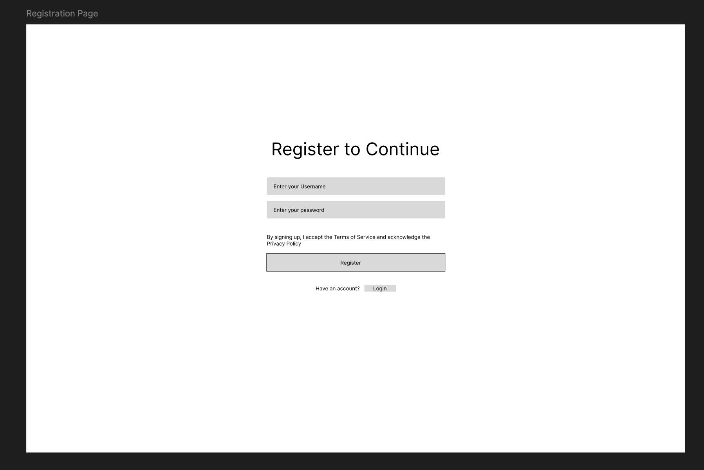
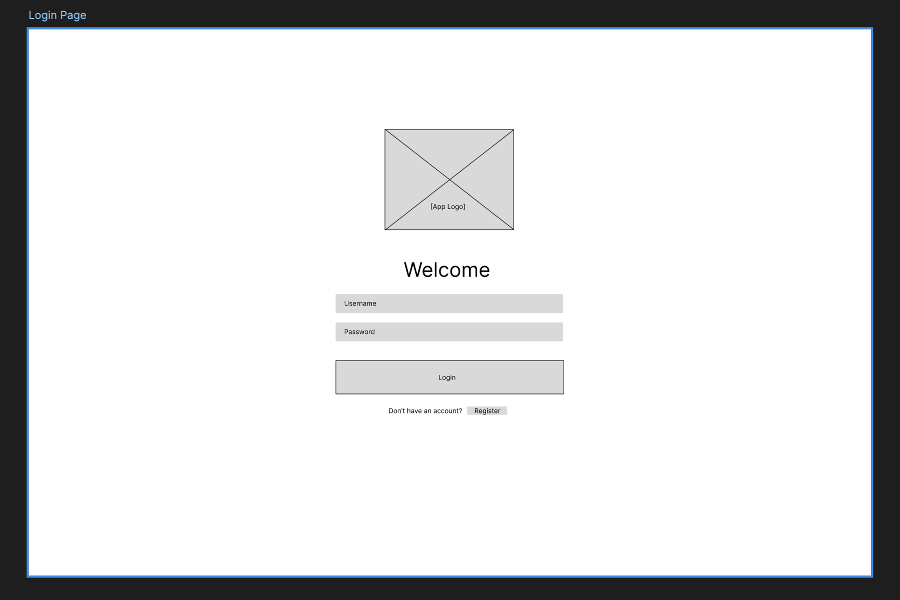
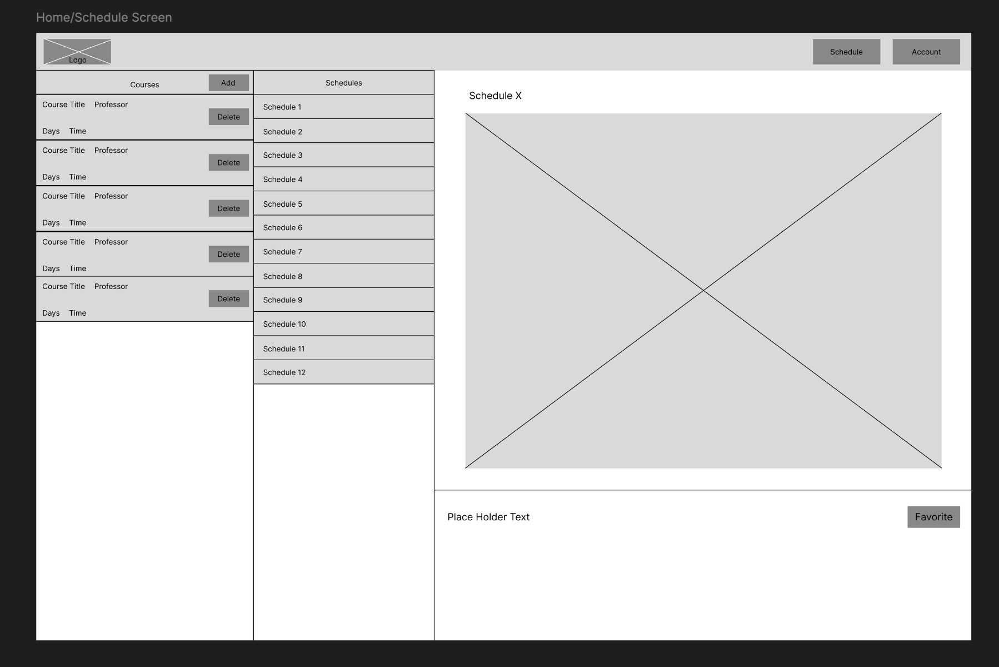
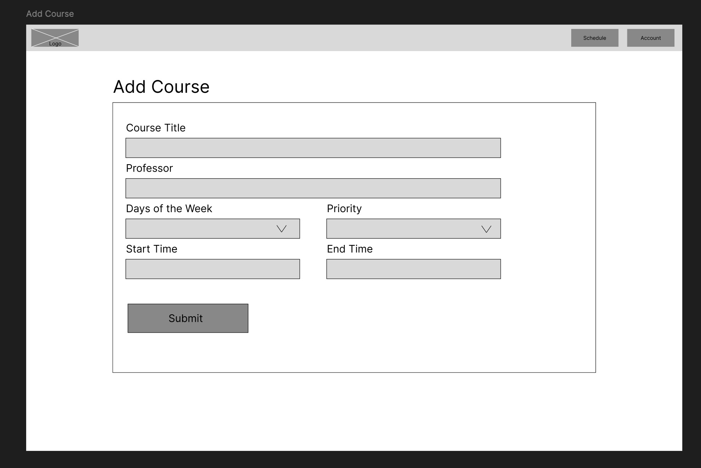
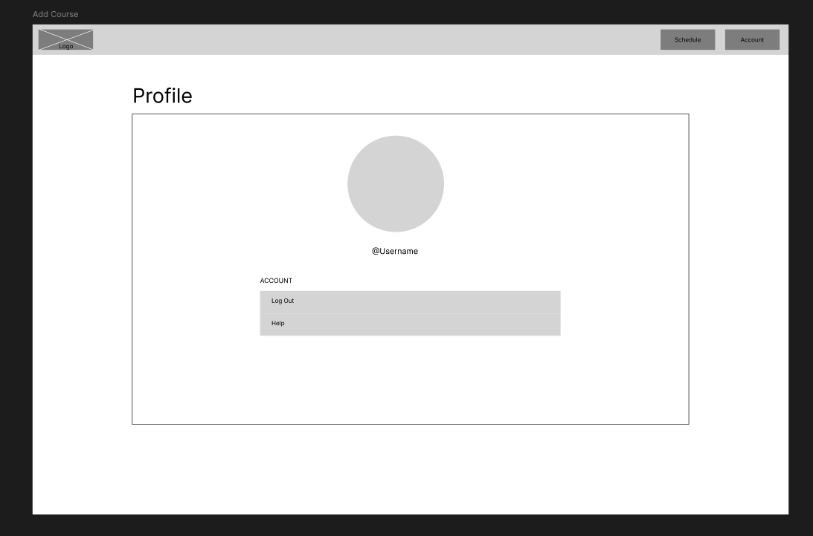
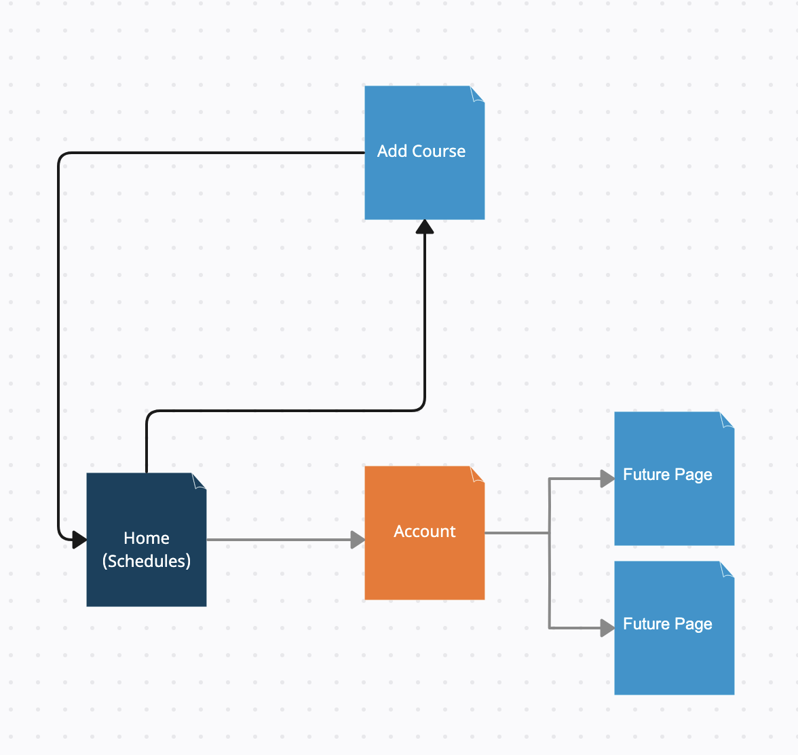

# CSG Schedule Generator

## Overview

Choosing courses for the upcoming semester is stressful. There are many schedule builder and planner applications yet what if you have too many course options? Most of these applications require you to manually build each schedule. This is when the CSG Schedule Generator comes in. 

After logging in, users can input classes and relevant information about that class that they're interested in and which will generate multiple possible schedules from various combinations of courses. The user can choose a course to be required/important which will result in the application priortize building the possible schedules around the required/important course(s). They will also be able to favorite specific schedules so that it will remain available the next time they log in. 


## Data Model

The application will store Users, Courses, and Schedules

* users can have multiple courses and schedules (via reference)
* each schedule can have multiple courses (via reference)
* each course will contain Course Title, Professor, Priority, as well as Date and Time. 

An Example User:

```javascript
{
  username: "tc3661",
  schedules: // an array of references to Schedule documents
  courses: // an array of references to Course documents
}
```

An Example Schedule:

```javascript
{
  user: // a reference to a User object
  name: // name of schedule
  courses: // an array of references to Course documents
  priorityCount: // number of priority courses in the schedule
  createdAt: // timestamp
}
```

An Example Course:

```javascript
{
  user: // a reference to a User object
  title: // name of schedule
  professor: // name of professor
  priority: = false, // boolean value, true for important 
  days: // days of the week that the lecture occurs on
  startTime: // start time of class
  endTime: // end time of class
  courseCredits: // number of credits for the course
  createdAt: // timestamp
}
```


## [Link to Commented First Draft Schema](db.mjs) 

## Wireframes

/login - page for logging in



/register - page for registering an account



/home - page that shows existing courses and generated schedules



/add-course - page for adding new courses



/account - page for viewing user account



## Site map


## User Stories or Use Cases

1. as non-registered user, I can register a new account with the site
2. as a user, I can log in to the site
3. as a user, I can add a new course
4. as a user, I want to view all of the courses I've added in a single list to manage them better. 
5. as a user, I want to be able delete existing courses from my course list so that I can discard any courses that I'm no longer interested in. 
6. as a user, I want to view a list of possible schedules generated from a list of existing courses so that I can choose my classes more efficiently. 
7. as a user, I want to mark a course with priority so that the generated schedules show me the most relevant options. 
8. as a user, I want to mark schedules as favorited so that it saves them to my account. 

## Research Topics

* (3 points) Unit testing with javascript
    * What are unit tests? "A unit is the smallest testable unit of code - typically a function, but sometimes an object or class." --- Professor Bloomberg. We use unit tests to verify and test the behavior of each "unit" of code by giving specific inputs. Unit testing solves the issue of inefficient manually testing code for errors. 
    * Possible candidate solutions:
        * Mocha
* (3 + 2 points) Utilize build tools (make) together with a CSS preprocessor
    * Build tools are softwares that automate the process of creating executuable applications/files from source code. It can complete tasks like generate build scripts, check the required version of software, save resources by recompiling minimally, integrate with testing tools, and report the result of builds and tests.
    * CSS Preprocessors are scripting language extensions for CSS allowing users to more easily write more complex css code with more features. We can use css preprocessors to allow variables, nesting logic, and modular building of css code. It helps improve maintainability, effciency, readability, and the scalability of css codes. 
    * Possible candidate solutions:
        * Sass
        * Less
        * Stylus
* (2 points) Utilize CSS Framework/ UI toolkit
    * CSS frameworks are pre-prepared libraries of CSS styles and templates providing a foundation for more consistent and better web design. CSS frameworks come with many templating features such as predefined layout systems, typography styles, and UI components. CSS frameworks help with faster deevelopment, more responsive and consistent css code. 
    * Possible candidate solutions:
        * tailwind.css
        * Bootstrap
        * Semantic UI
* (? points) External API (Undecided)
  * Implement Web Share API
  ~~* Use Bcrypt for user authentitcation ~~

* (5 points) Integrate user authentication
    * Passport.js is a middleware for Node.js that allows for user authentication. It is flexible and can be used with many different strategies. It is easy to use and has a large community. 
    * Possible candidate solutions:
        * Passport.js


## [Link to Initial Main Project File](app.mjs) 


## Annotations / References Used


1. [used coursicle as inspiration for UI/UX design](http://passportjs.org/docs)

